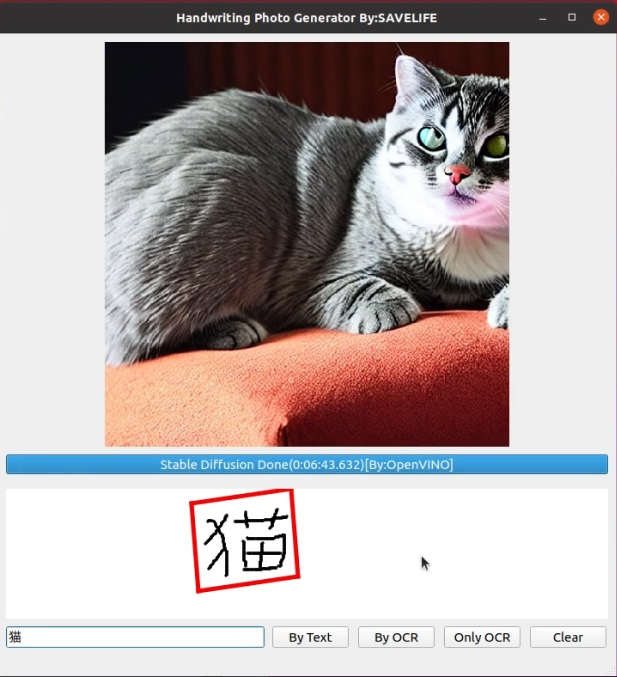
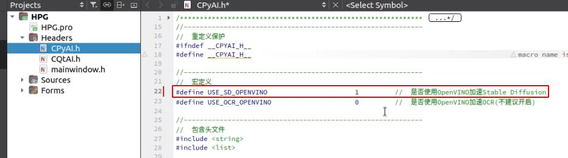
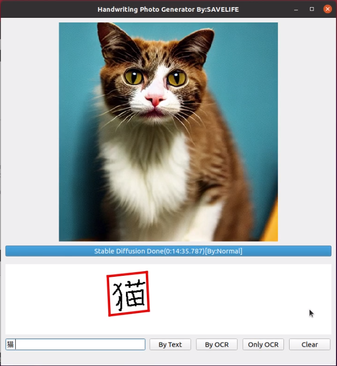

# HPG(Handwriting Photo Generator)
## 1、运行效果



## 2、编译环境搭建

### 2.1、操作系统与硬件要求

操作系统：Ubuntu 20

硬件平台：Intel酷睿或者志强，支持AVX指令集，内存16GB以上

### 2.2、软件依赖安装

基本的软件依赖

```shell
sudo -E apt-get install gcc g++ make git vim build-essential
```

安装python3

```shell
sudo -E apt-get install python python3 python3-pip
sudo -E pip3 install --upgrade pip
```

安装diffusers相关依赖

```shell
sudo -E pip3 install --upgrade "diffusers==0.25.0" "transformers==4.36.2" "torch==2.1.2"
```

安装OCR依赖

```shell
sudo -E pip3 install --upgrade "shapely" "pyclipper" "paddlepaddle" "paddlehub"
```

如果遇到'blinker'的错误，请执行下面命令处理

```shell
sudo -E apt-get remove blinker
sudo -E -H pip3 install --ignore-installed -U blinker
```

然后配置合适的numpy版本

```shell
sudo -E pip3 install --upgrade "numpy==1.21.6"
```

安装OpenVINO

```shell
sudo -E pip3 install --upgrade "ipywidgets==8.1.1" "optimum==1.16.1" "openvino==2023.2.0" "openvino-dev==2023.2.0" "optimum-intel[openvino,diffusers,nncf,onnx]==1.12.3" "testresources==2.0.1" "dill==0.3.4" "multiprocess==0.7.0.12.2" --ignore-installed PyYAML
```


### 2.3、模型下载

模型位置：https://huggingface.co/IDEA-CCNL/Taiyi-Stable-Diffusion-1B-Chinese-EN-v0.1

下载命令

```shell
#!/bin/bash
git lfs install
git clone https://huggingface.co/IDEA-CCNL/Taiyi-Stable-Diffusion-1B-Chinese-EN-v0.1
```


### 2.4、环境验证

分别执行源码中的4个验证脚本即可，注意！该步骤为必须的，因为首次执行它们的时候，会下载一些缓存文件。

```shell
./ocr_test.sh
./ocr_openvino_test.py
./sd_test.py
./sd_openvino_test.py
```


### 2.5、Qt安装和编译

我这里使用的是qt5.13.2的linux安装包，可以从下面的地址下载

https://download.qt.io/new_archive/qt/5.13/5.13.2/qt-opensource-linux-x64-5.13.2.run

下载完成后，给该文件增加可执行权限

```shell
chmod +x qt-opensource-linux-x64-5.13.2.run
```

然后按照界面的提示一步一步安装即可，详细安装过程可以参考下面的演示视频

然后编译的话只要用Qt Creator打开我们源码中的HPG.pro工程即可

## 3、使用OpenVINO加速

### 3.1、修改源码



如图所示，只要将CPyAI.h文件中的USE_SD_OPENVINO宏改为1后，即可打开OpenVINO加速支持

### 3.2、加速效果对比




同样的关键字，加速前耗时14分35秒，使用OpenVINO加速后，耗时6分43秒

## 4、方案与原理

### 4.1、概述

​    本开源软件可以用于少儿教育领域 或 相关教育行业，在学生学习写字的同时，也能通过人工智能生成对应的图片，激发学生的联想记忆，帮助学生更快速的掌握汉字或英文的书写。

​    该软件的整体思想是将手写产生的数据通过OCR模型转换为文本数据后，然后再将文本数据通过中英文混合的Stable Diffusion模型生成出图像。该软件打破了教育行业中传统固定文字卡片的约束，而是通过人工智能技术生成图文并茂的文字图片关联，增强学生的记忆。同时这也是本软件的亮点之一。更重要的是，本软件可以完全断网本地化运行，不依赖于任何云服务后台。所以可以集成到学习机和早教机中。

### 4.2、使用模型

https://www.paddlepaddle.org.cn/hubdetail?name=chinese_ocr_db_crnn_server&en_category=TextRecognition

 https://www.paddlepaddle.org.cn/hubdetail?name=chinese_ocr_db_crnn_mobile&en_category=TextRecognition

https://paddleocr.bj.bcebos.com/PP-OCRv3/chinese/ch_PP-OCRv3_det_infer.tar
https://paddleocr.bj.bcebos.com/PP-OCRv3/chinese/ch_PP-OCRv3_rec_infer.tar

https://huggingface.co/IDEA-CCNL/Taiyi-Stable-Diffusion-1B-Chinese-EN-v0.1

### 4.3、工作流与参考源码


软件的整体工作流如图所示，首先手写文字的图像数据经过OCR模型以后，产生文本输出结果，然后再将该文本结果送入到Stable Diffusion模型中产生最终的图像输出

源码参考：https://github.com/zhuo-yoyowz/openvino_notebooks

## 5、演示视频

【手写文字图片生成器(支持OpenVINO)-哔哩哔哩】 https://b23.tv/qUF8bfu

## 6、联系方式

邮箱：rainhenry@savelife-tech.com

## 7、许可证

本代码采用GPLv3许可证 https://www.gnu.org/licenses/gpl-3.0.en.html
